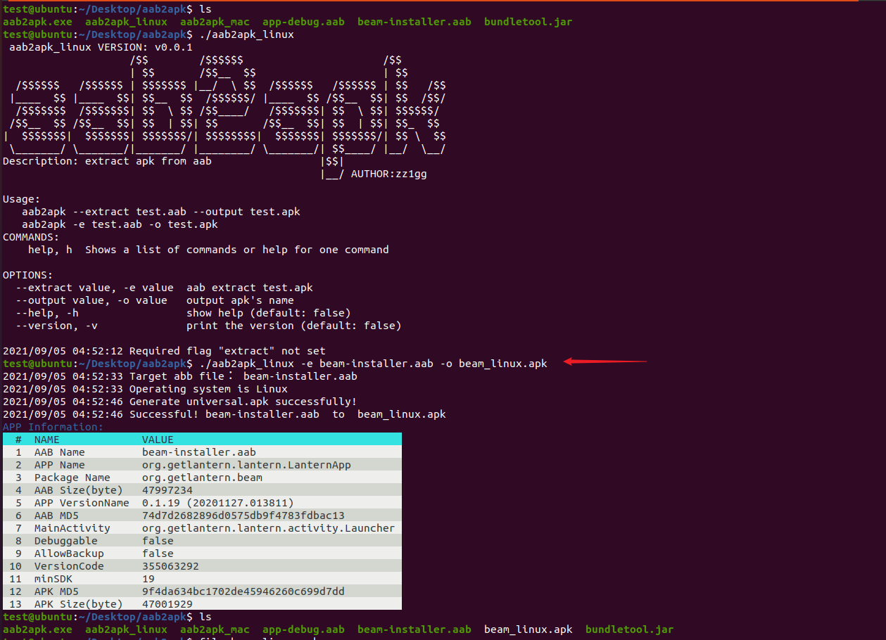

# aab2apk🔧

[AAB](https://developer.android.com/guide/app-bundle): An Android App Bundle is a publishing format that includes all your app’s compiled code and resources, and defers APK generation and signing to Google Play.

In some test scenarios, you need to convert AAB to APK. At this point, you can use this tool, which is very easy to operate.

## description 📒 

This tool is named aab2apk. Because it converts AAB to APK, and extracts some interesting information.

The Feature:

- cross platform
- output format pretty
- The operation is simple, just one command `aab2apk -e test.aab -o test.apk`
- get some interesting information

## How to use

on Windows:

```
aab2apk.exe -e test.aab -o test.apk
```


on Mac:

```
./aab2apk_mac -e test.aab -o test.apk
```


on Ubuntu:

```
./aab2apk_linux -e test.aab -o test.apk
```



## notice⚠️

- [bundletool.jar](https://github.com/google/bundletool/releases) needs to be placed in the aab2apk tool root directory. If your environment is no bundletool, plz go to https://github.com/google/bundletool/releases
- Random APP samples in the pictures to verify that the tool works. It's random!!! You can choose the APP you want to test,and not it!

